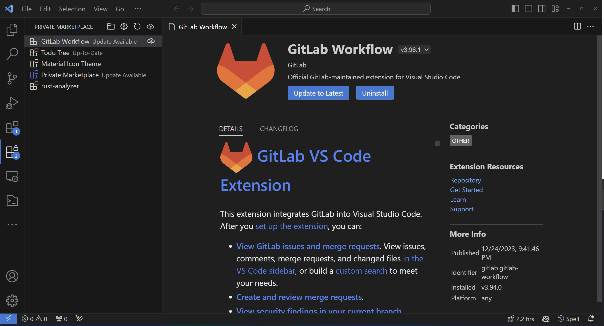
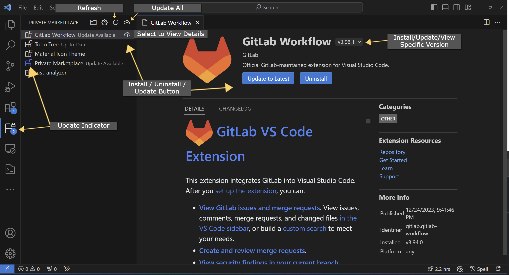

# Private Marketplace

## Description

Private Marketplace is a Visual Studio Code extension designed for corporate environments. It provides a private marketplace for managing and distributing extensions within your organization.

## Features

- **Secure Extension Management:** Keep control over the extensions available in your corporate environment.
- **Centralized Distribution:** Easily distribute and manage extensions within your organization.
- **Offline Support:** Install extensions without an internet connection.
- **Auto Updates:** Automatically update extensions when new versions are available.
- **Easy Configuration:** Quickly configure by configuring the directory where the extensions are stored.

## Getting Started

### Installation

1. Open Visual Studio Code.
2. Go to the Extensions view (`Ctrl+Shift+X` or `Cmd+Shift+X`).
3. Search for "Private Marketplace" and click Install.

### Configuration

To configure Private Marketplace, follow these steps:

1. Add the directory where the extensions are stored once prompted or using the folder icon in the extension's view.

#### Optional:

2. Open the extension's settings using the gear icon in the extension's view.
   - Enable auto updates by ticking the "Auto Update" checkbox.
   - Check updates every 1h by ticking the "Check Update" checkbox.

## Usage

1. Open the private marketplace extension view
2. Select the extension you want to install , update or uninstall
3. Click the install, update or uninstall button

## Infos

- The extension searches for extensions in the configured directory (max. depth: 3) and displays them in the private marketplace extension view.
- Specific versions can be selected using the version dropdown.
- If the target platform isn't specified, the extension will not be displayed.
- The published date is based on the last modified date of the extension in the directory.
- The markdown view doesn't currently support local images.

## Contributing

Contributions are welcome!.

1. Fork the repository.
2. Create a branch for your feature (`git checkout -b my-feature`).
3. Commit your changes (`git commit -am 'Add my feature'`).
4. Push to the branch (`git push origin my-feature`).
5. Create a new Pull Request
6. Sit back and wait

## License

This extension is licensed under the [MIT License](LICENSE).

## Support

If you encounter any issues or have questions, please open an issue on the [GitHub repository](https://github.com/oxdev03/pvmp).
