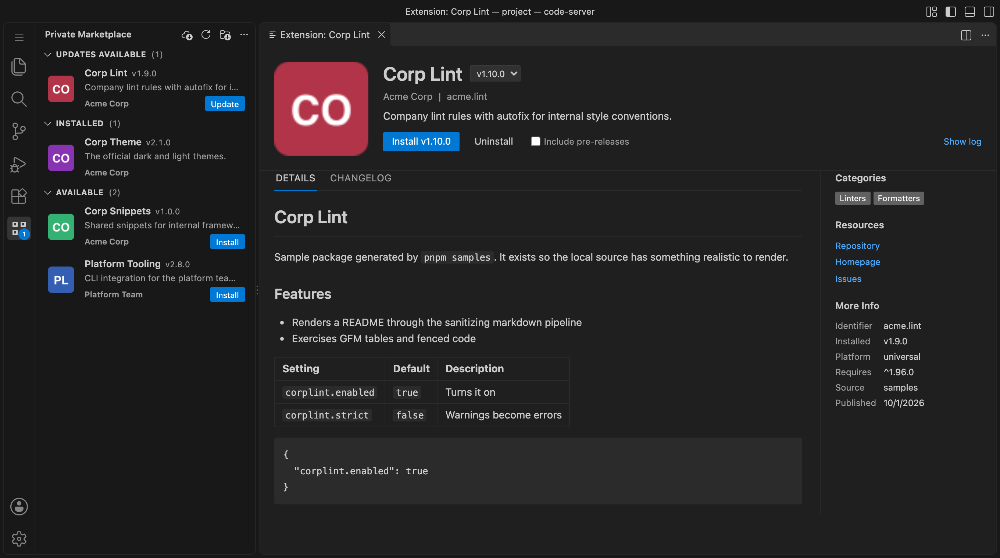
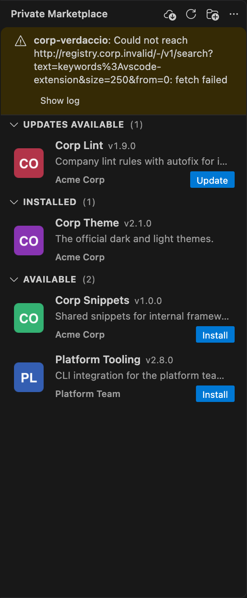

# Private Marketplace

A VS Code extension for installing your organisation's own extensions. Publish
them as npm packages to the registry you already run (JFrog Artifactory,
Sonatype Nexus or Verdaccio), or put them in a folder. Developers browse,
install and update them in a view that matches VS Code's Extensions view.
There is no pvmp server.

<picture>
  <source media="(prefers-color-scheme: light)" srcset="docs/images/overview-light.png">
  
</picture>

## How it works

Each extension is an npm package with the `.vsix` inside. Your registry's
auth, retention and proxying already cover it, and pvmp's catalog comes from
packuments, which list every version's metadata in one request. pvmp reads the
first few KB of a package for its icon, and downloads the rest only to show
the README or to install it.

## Features

- The list and details page use VS Code's own metrics and theme colours, so
  they match the built-in view in every theme, high contrast included.
- Outdated extensions get their own section and a count on the activity-bar
  badge. Update them one at a time, all at once, or automatically. A failed
  update waits before it retries.
- Sources are listed in priority order. When two offer the same version, the
  first wins, and the details page shows the other as shadowed.
- Builds for other platforms, and versions that need a newer VS Code, are
  hidden. Pre-releases are opt-in per extension.
- Tokens and passwords go in the OS keychain, never in settings. A registry
  URL with credentials in it is rejected, and URLs in logs and errors have
  credentials stripped.
- In a devcontainer, over SSH or in code-server, pvmp runs on the remote side
  and installs extensions there.



### When a source fails

A source that is down, misconfigured or wants a token gets its own banner,
and the other sources keep listing. A banner for an auth failure has a
**Sign in** button.

**Show log** opens the output channel. Set its level to _Trace_ in the Output
panel to see every request, without reloading.

<br clear="right">

## Getting started

1. Install **Private Marketplace** from the VS Code Marketplace or Open VSX, or
   install a `.vsix` from [Releases](https://github.com/oxdev03/pvmp/releases).
2. Open **Private Marketplace** in the activity bar.
3. Add a source. Click the folder button for a local directory, or edit
   `pvmp.sources` in settings:

```jsonc
{
  "pvmp.sources": [
    // A folder of .tgz packages, for air-gapped machines or quick trials.
    { "type": "local", "path": "${userHome}/vsix" },

    // Any npm registry. The adapter lists the catalog; the rest is plain npm.
    {
      "type": "npm",
      "id": "corp",
      "registry": "https://art.corp/artifactory/api/npm/npm-local/",
      "scope": "@corp",
    },
  ],
}
```

4. If the registry needs auth, run **Private Marketplace: Sign in to Source**
   and paste a token. For Nexus, type `username:password` instead: its REST
   API does not accept npm tokens.

## Sources

| `type`  | Reads from                         | Notes                                        |
| ------- | ---------------------------------- | -------------------------------------------- |
| `local` | A directory of `.tgz` packages     | `depth` (default `3`) bounds the scan.       |
| `npm`   | Any npm registry, via an `adapter` | `scope` limits the catalog to one npm scope. |

npm has no portable way to list a registry's packages. The adapter does that
and nothing else; packuments, tarballs and auth use the plain npm protocol.

| `adapter`   | Lists packages with                      | Inferred from a registry URL containing |
| ----------- | ---------------------------------------- | --------------------------------------- |
| `jfrog`     | `GET /api/storage/<repo>?list&deep=1`    | `/api/npm/`                             |
| `nexus`     | `GET /service/rest/v1/components`        | `/repository/`                          |
| `verdaccio` | `/-/all`, falling back to `/-/v1/search` | never; set it explicitly                |

Set `repo` and `baseUrl` when the adapter cannot derive them from `registry`,
for example behind a reverse proxy.

Path settings accept `${userHome}`, `${workspaceFolder}` and `${env:NAME}`. In
a remote window they resolve on the remote machine, and the resolved path is
written to the log.

## Publishing an extension

An extension package is an npm tarball with the `.vsix` inside and the metadata
in front of it:

```
package/
  package.json     your extension manifest's fields, plus a "pvmp" block
  CHANGELOG.md
  README.md
  icon.png
  extension.vsix   last, so pvmp can read the icon without downloading it
```

[`docs/publishing.md`](docs/publishing.md) has the format, a twenty-line build
script, and CI examples for GitHub Actions, GitLab and Jenkins.

## Reference

### Commands

| Command                                    | What it does                                           |
| ------------------------------------------ | ------------------------------------------------------ |
| Private Marketplace: Refresh Sources       | Re-read every source now.                              |
| Private Marketplace: Update All Extensions | Install every available update, then offer one reload. |
| Private Marketplace: Add Folder Source     | Pick folders and append them to `pvmp.sources`.        |
| Private Marketplace: Sign in to Source     | Store a token or username:password in the OS keychain. |
| Private Marketplace: Show Log              | Open the output channel.                               |
| Private Marketplace: Open Settings         | Jump to pvmp's settings.                               |

### Settings

| Setting              | Default | What it does                                          |
| -------------------- | ------- | ----------------------------------------------------- |
| `pvmp.sources`       | `[]`    | Where extensions come from, in priority order.        |
| `pvmp.autoUpdate`    | `false` | Install updates during the background check.          |
| `pvmp.checkInterval` | `3600`  | Seconds between background checks. `0` disables them. |
| `pvmp.cacheSizeMb`   | `200`   | Cap on the metadata and icon cache.                   |

### Requirements and limits

- VS Code 1.96 or later on desktop, including devcontainers, Remote SSH and
  code-server.
- VS Code for the Web is not supported. It cannot install from a `.vsix`, and
  your registry would have to send CORS headers to `vscode.dev`.
- There is no search or filtering yet; both are planned for 3.0.

## Status

2.0 is a rewrite. It shares no code with 1.x and does not read 1.x settings.
[`SPEC.md`](SPEC.md) records the design and the reasons behind it.

Two things need testing on real infrastructure before 2.0 ships:

- The JFrog and Nexus adapters have only been tested against recorded API
  responses. Verdaccio runs in a live container test. If you run JFrog or
  Nexus, a report helps.
- Nobody has yet confirmed where installs land in a real devcontainer or in
  code-server.

## Development

You need Node 20.19+ and pnpm 11, plus Docker or Podman for the integration
tests and screenshots.

```bash
pnpm install
pnpm dev               # the webview alone, against a mocked host
pnpm check             # lint, format and typecheck
pnpm test              # unit tests
pnpm e2e               # Playwright against the webview (pixel checks skip off Linux)
pnpm test:integration  # live Verdaccio via testcontainers
pnpm package           # build pvmp.vsix
pnpm screenshots       # regenerate the README images in code-server
```

Press <kbd>F5</kbd> in VS Code to launch an Extension Development Host. Run
`pnpm samples` first: it writes example packages and a `dev-workspace` that is
already configured to use them.

`pnpm dev` serves the webview at <http://localhost:5183> without VS Code, for
example `/?view=details&ext=acme.lint&theme=hc`. Add `fixture=` for states
that are hard to set up by hand: `auth`, `unreachable`, `slow-install`,
`install-fails`, `unsafe-readme`, `empty` or `many`.

```
apps/
  extension/      The VS Code host. Its package.json is the extension manifest.
  webview/        React and Vite: the sidebar and details views.
packages/
  contract/       Typed IPC and domain types. No runtime dependencies.
  core/           Version resolution, tarball reading, cache, source interfaces.
  source-local/   A folder of .tgz packages.
  source-npm/     Any npm registry, plus one catalog adapter per vendor.
```

`core` never imports `vscode`; the host injects everything it needs, so
plain Vitest tests resolution, caching and parsing.

Regenerate visual goldens with `apps/webview/scripts/update-visual-goldens.sh`
(`--check` compares without writing). It runs in the Playwright container CI
uses, because macOS renders fonts too differently to compare.

## Licence

MIT. The layout metrics come from
[microsoft/vscode](https://github.com/microsoft/vscode) (MIT). The theme token
generator replaces the archived
[`@githubocto/tailwind-vscode`](https://github.com/githubocto/tailwind-vscode)
(MIT).
